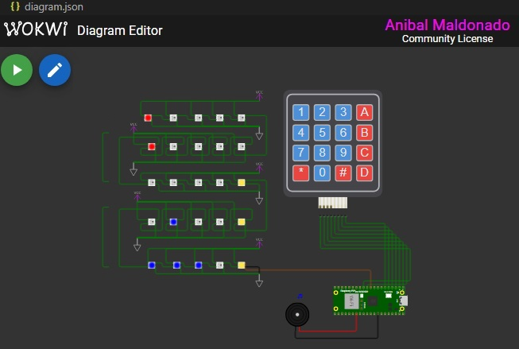

# Animação de Matriz de LEDs - Subgrupo 7 - Embarcatech
Geração de animações em uma matriz de LEDs 5x5. Com o auxílio do simulador de eletrônica Wokwi, utilize o Raspberry Pi Pico W e um teclado matricial 4x4 (ilustrado na Figura 1) para gerar informações visuais em uma matriz de LEDs Coloridos (5x5 WS2812)


Figura 1: Diagrama do projeto com as conexões

## Video no Youtube do projeto: ##
[Vídeo do youtube](https://youtu.be/68q5n1tdRc4)

### Tarefas ###

- [X] Tarefa 01
- [X] Tarefa 02
- [X] Tarefa 03
- [X] Tarefa 04
- [X] Tarefa 05
- [X] Tarefa 06
- [X] Tarefa 07
- [X] Tarefa 08
- [x] Tarefa 09

### Finalidade do projeto:

1) As teclas de 0 a 9 do teclado matricial, caso acionadas, o
sistema deve executar algum tipo de animação na matriz
de LEDs 5x5. Os tipos de desenho, cores (RGB) e
luminosidades associados a estas imagens/animações
ficam a critério dos membros da equipe de
desenvolvimento. No total, serão considerando uma animação por membro desta
equipe. 
2) Cada animação deve possuir, no mínimo, 5 frames
(imagens diferentes) e o FPS (quantidade de quadros por
segundo) também deve ser definido pela equipe de
desenvolvimento. 

> Obs.2: É importante que as animações
produzidas sejam fluidas e de fácil entendimento.
3) Caso a tecla A seja acionada, todos os LEDs deverão ser
desligados.
4) Caso a tecla B seja acionada, todos os LEDs deverão ser
ligados na cor azul, no nível de intensidade de 100% da
luminosidade máxima.
5) Caso a tecla C seja acionada, todos os LEDs deverão ser
ligados na cor vermelha, no nível de intensidade de 80%
da luminosidade máxima.
6) Caso a tecla D seja acionada, todos os LEDs deverão ser
ligados na cor verde, no nível de intensidade de 50% da
luminosidade máxima.
7) Caso a tecla # seja acionada, todos os LEDs deverão ser
ligados na cor branca, no nível de intensidade de 20% da
luminosidade máxima.
8) Especificação opcional: gerar sinal sonoro para uma das
animações usando o componente buzzer.
9) Especificação opcional: Caso a tecla * seja acionada, o
Raspberry Pi Pico W deve sair do modo de execução e
habilitar o modo de gravação via software (reboot).

## Descrição Geral

O sistema controla uma matriz de LEDs WS2812B conectada ao Raspberry Pi Pico W. A interação é feita por meio de um teclado matricial 4x4, onde cada tecla aciona uma função ou animação específica. 

Cada uma das animações tem seus próprios arquivos .c para comportar as matrizes e seus devidos arquivos .h para terem seus cabeçalhos.

### Funcionalidades Implementadas
1. **Animações por Tecla (0-9) com pelo menos 5 frames e é configurada fluida.**:
   - Cada tecla de `0` a `9` aciona uma animação diferente.
  
     - Animações:
     
        Anibal Maldonado:  Ao acionar o número '1' apresenta uma animação do jogo Tetris com efeito sonoro de um buzzer

        Yuri: Ao acionar o número '2' apresenta a animação do jogo da cobra que tenta capturar as maçãs

2. **Comandos Específicos**:
   - **Tecla `A`**: Desliga todos os LEDs.
   - **Tecla `B`**: Liga todos os LEDs na cor azul com 100% de intensidade.
   - **Tecla `C`**: Liga todos os LEDs na cor vermelha com 80% de intensidade.
   - **Tecla `D`**: Liga todos os LEDs na cor verde com 50% de intensidade.
   - **Tecla `#`**: Liga todos os LEDs na cor branca com 20% de intensidade.
   - **Tecla `*`**: Reinicia o microcontrolador em modo de gravação.

3. **Efeitos Sonoros**:
   - Um buzzer é utilizado para emitir sons durante algumas animações.

### Estrutura do Projeto

```plaintext
/
├── animacao_matriz.c       # Código principal do projeto
├── tetris.c                # Contém a matriz de frames das animações
├── tetris.h                # Header file para tetris.c
├── animacao_matriz.pio     # Código PIO para controle dos LEDs WS2812B
├── CMakeLists.txt          # Configuração para build com CMake
├── wokwi.toml              # Configuração do simulador Wokwi
├── diagram.json            # Diagrama do circuito para Wokwi
├── README.md               # Documentação do projeto
```
Configuração do Ambiente
Hardware:

Raspberry Pi Pico W.
Matriz de LEDs WS2812B (5x5).
Teclado matricial 4x4.
Buzzer.
Simulador:

O projeto foi configurado para uso no VS code com o simulador Wokwi.

Software:

SDK do Raspberry Pi Pico.

CMake para compilação.

**Como Executar**

1. Clone este repositório:
```
git clone https://github.com/yuriccosta/animacao-matrizLED-grupo7-embarcatech.git
cd animacao-matrizLED-grupo7-embarcatech
```

2. Configure o ambiente de build:
```
mkdir build && cd build
cmake ..
make
```

3. Carregue o código no Raspberry Pi Pico W:

Coloque o Pico em modo de gravação conectando-o ao computador enquanto pressiona o botão BOOTSEL.
Copie o arquivo .uf2 gerado para o dispositivo.

4. Simule o circuito no VS Code utilizando o Wokwi:

Abra o arquivo diagram.json no VS Code e inicie a simulação.

**Melhorias Futuras**

1. Criar as animações faltantes pelos integrantes da equipe.

2. Permitir que o FPS das animações seja ajustado dinamicamente.

3. Realizar testes completos em hardware real para validar o funcionamento.


